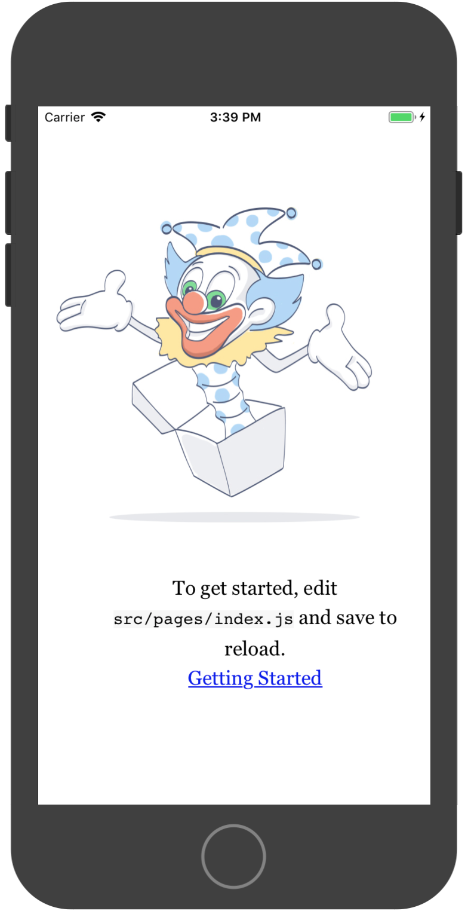
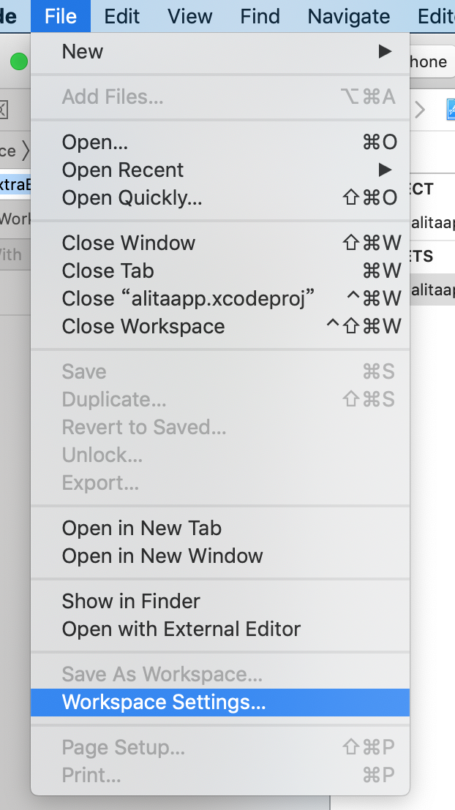

# @alitajs/cordova

[](https://npmjs.org/package/@alitajs/cordova) [](https://npmjs.org/package/@alitajs/cordova)

umi support cordova

## Usage

## 安装环境（Mac）

1.安装 XCode

2.安装 xcode-select

```bash
xcode-select --install
```

弹出软件一直下一步就好。

3.安装 ios-deploy

```bash
sudo yarn global add ios-deploy
```

4.全局安装 Cordova

```bash
sudo yarn global add cordova
```

## 接入 cordova

### umi 项目

Configure in `.umirc.js`,

```sh
yarn add @alitajs/cordova
```

```js
export default {
  plugins: [['@alitajs/cordova', options]],
};
```

### alita 项目

Configure in `config/config.js`,

```js
export default {
  appType: 'cordova',
};
```

## 添加 cordova 初始化命令

如果你全局安装了 `umi` ，可以使用`umi cordova --init --ios`

如果你没有全局安装 `umi` ，可以在 `package.json` 里面添加 `scripts`

```json
{
  "scripts": {
    "cordova-init": "umi cordova --init",
    "cordova-add-ios": "umi cordova --ios",
    "cordova-add-android": "umi cordova --android",
    "start": "umi dev",
    "start-cordova-android": "CORDOVA=android umi dev",
    "build-cordova-android": "CORDOVA=android umi build",
    "build": "umi build"
  }
}
```

| 参数      |                     说明                      |
| :-------- | :-------------------------------------------: |
| --init    | 初始化 Cordova 项目，添加配置文件和相关文件夹 |
| --ios     |        执行 cordova platforms add ios         |
| --android |      执行 cordova platforms add android       |

### 环境变量 CORDOVA

默认使用的平台是 ios，如果开发安卓，需要设置环境变量

如果`umi cordova --init --ios` 一直没有动静，可以`ctrl+c`关闭进程，手动执行`cordova platforms add ios`

## 启动项目

开发环境执行 `umi dev` dev 环境有热更新，如果使用手机查看，要求需要在统一个网络环境下。

编译执行`umi build`

使用**xcode**打开项目 `./platforms/ios/Tutorial.xcworkspace` 选择虚拟机，执行。

虚拟机中查看效果 

## 注意事项

### Mac

Xcode10 要修改编译系统 File->Workspace Setting  修改 Build System -> Legacy Build System 

### Android Studio

`umi dev` 和 `umi build` 的时候要设置环境变量`CORDOVA=android`

如果使用的是 Mac，可以通过命令安装 java 环境

```bash
brew cask install java
```

对安卓开发不熟悉的朋友，注意看右下角的窗口，会有提示需要安装 sdk，先装完 sdk。

```bash
The minSdk version should not be declared in the android manifest file. You can move the version from the manifest to the defaultConfig in the build.gradle file.
Open Manifest File
Move minSdkVersion to build file and sync project
```

点击 “Move minSdkVersion to build file and sync project”

接着点击运行项目，在 Android Studio 右上角，点击绿色小三角形按钮。

然后选择一个模拟器，如果没有就点击左下角新建，随便选一个你喜欢的下载，然后弹出提示全部选择蓝色默认的选项一直下一步。（就是选择完成，安装，之类的）。


## LICENSE

MIT
